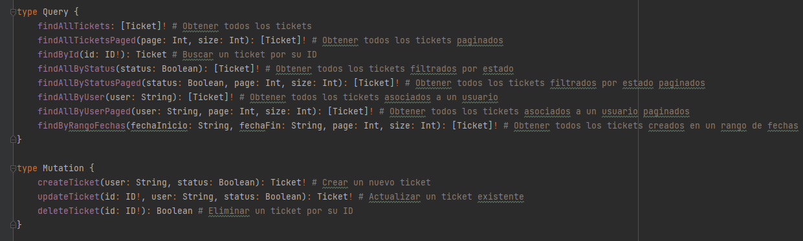

# TicketsApp

Proyecto para la gestion de tickets

# Tabla de contenidos:
- [Guía de usuario](#-guía-de-usuario)
- [Guía de instalación](#-guía-de-instalación)
- [Autor/es](#-autores)
- [Información adicional](#-información-adicional)

## Guía de usuario
---
En el correo se adjunta una coleccion en postman con cada una de las querys y mutaciones solicitadas:

## Guía de instalación
---
Como se solicito se usaron dos contenedores para la base de datos, uno como core y el otro como gestor. La base de datos utilizada en el entorno de desarrollo fue postgres.
Ademas se sumo la parte de dockerizar la aplicacion.

La guía de instalación debe contener de manera específica:
- Si se desea correr la aplicacion en local directamente desde el IDE:
  1. Ejecutar una terminal o usar la que provee su IDE.
  2. Ubicarse en el root del proyecto
  3. Subir la base de datos con el comando: "docker-compose up -d postgres"
     1. Opcional si desea subir pgadmin reemplace el comando por el siguiente "docker-compose up -d postgres pgadmin" 
  4. Verificar en el archivo properties (application.properties)
     1. Que el profile se encuentre en localhost: spring.profiles.active=localhost
  5. Ejecutar la aplicacion.
- Si se desea dockerizar la aplicacion
  1. Verificar en el archivo properties (application.properties)
     1. Que el profile se encuentre en localhost: spring.profiles.active=postgreSQL
  2. Ejecutar una terminal o usar la que provee su IDE.
  3. Ubicarse en el root del proyecto
  4. Generar la imagen para el contenedor ya que no se a subido a un repositorio
     1. Generar el .jar del proyecto esto se hace con el comando de maven: mvn install -DskipTests=true
     2. Despues con el docker-compose se suben todos los contenedores: "docker-compose up -d"

## Autor/es
---
Ivan Rene Mendoza Pinzon -- Backend Developer

## Información adicional
---
Correo: imendoza@unab.edu.co

Celular: +57 3203370063

[LinkedIn](https://www.linkedin.com/in/ingivanmendoza/)

[GitHub](https://github.com/IMENDOZA21)
